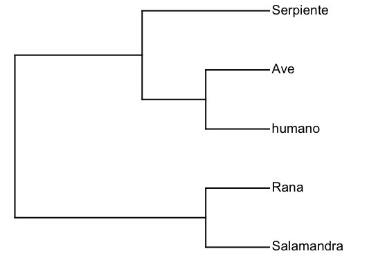
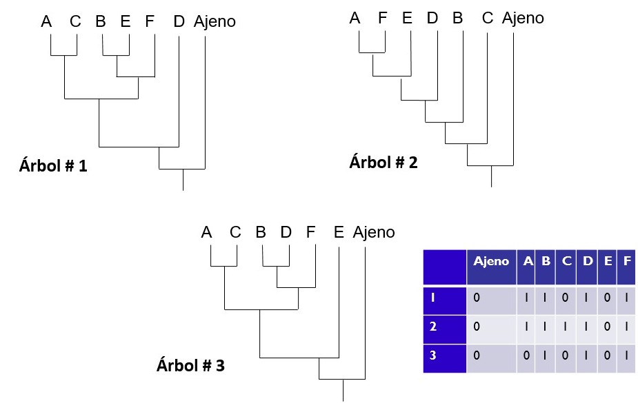
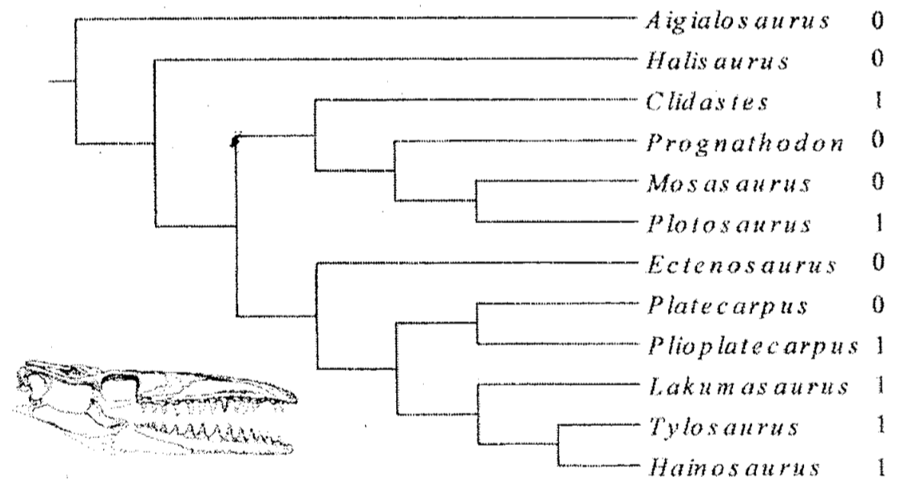

# TALLER. MÉTODOS DE DISTANCIA, ARGUMENTACIÓN HENNIGIANA Y MÁXIMA PARSIMONIA

_[Volver a inicio](/README.md)_

## PARTE 1

#

Considere la siguiente matriz de caracteres, cuyo grupo interno son varios taxones de Angiospermas y el grupo ajeno es un taxon de gimnospermas (pino):

1. Con base en esta matriz, genere una submatriz de 5 taxones (pino, aguacate, soya, cacao y tomate), genere la matriz de distancias entre estos taxones e infiera el árbol de distancias usando UPGMA.

2. Con base en la matriz completa, infiera el árbol usando argumentación Hennigiana.

3. Con base en la matriz completa, infiera cual de los siguiente dos árboles es el más parsimonioso, usando el criterio de optimalidad de la Máxima Pasimonia:

**Árbol 1**:  **Árbol 2**: 

#

## PARTE 2

#

Suponga que el siguiente es el mejor árbol filogenético de las relaciones evolutivas de los tetrápodos:

Este árbol fue inferido con base en la siguiente matriz de secuencias de ADN:

|Taxón|1|2|3|4|5|6|7|8|9|10|10a|10b|11|12|13|14|15|16|17|18|19|20|
|---|---|---|---|---|---|---|---|---|---|---|---|---|---|---|---|---|---|---|---|---|---|---|
|Salamandra|G|T|A|A|C|G|A|T|A|T|A|G|A|G|C|C|C|T|A|G|A|T|
|Rana|G|A|A|A|C|G|A|T|A|T|A|G|A|G|C|C|C|T|A|G|A|T|
|Serpiente|G|T|A|A|G|G|A|T|A|T|-|-|A|G|C|C|C|T|A|G|G|T|
|Ave|G|C|A|A|G|G|A|T|A|T|-|-|A|G|C|C|C|C|A|G|A|T|
|Humano|G|T|A|T|G|G|A|T|A|T|-|-|A|G|-|-|-|C|A|G|A|T|

Usando esta matriz y el árbol: 

1. Optimice los caracteres informativos en árbol usando el criterio de polarización _a posteriori_.

2. Calcule la longitud del árbol usando el criterio de la Máxima Parsimonia.

#

## PARTE 3 

#

Considere las tres hipótesis filogenéticas y la matriz de caracteres de la siguiente figura:

Con base en esta información:

1. Optimice los caracteres en cada hipótesis filogenética.

2. Calcule la longitud de árbol de cada hipótesis filogenética.

3. Indique cual es la hipótesis filogenética más parsimoniosa.

#

## PARTE 4

#

Con base al siguiente árbol y el caracter ilustrado en la siguiente figura:

1. Optimice el caracter usando la optmización ACCTRAN y estime el número de pasos del caracter.

2. Optimice el caracter usando la optmización DELTRAN y estime el número de pasos del caracter.
